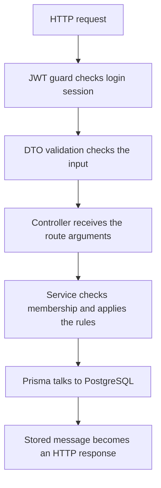

# Huddle backend: completed improvements and why they matter

This guide explains the backend changes that were completed: where the code is, what it does, why it belongs there, how it affects Huddle, and what would happen without that behavior. Read it as a guided tour of the code rather than a list of unexplained edits.

There are two backend guides:

| Guide | What you will learn |
| --- | --- |
| [Testing, findings, and remaining checks](README-TESTS.md) | How to run every test, the problems and evidence gaps found during the review, what each test checks, the recorded results, and what still needs separate verification. |
| This guide: completed improvements | How each completed change works, its exact source location and purpose, and how to configure and use the resulting backend. |

The latest recorded full verification was on **12 September 2026**. The tests and other checks passed; their complete counts and results are in the [testing guide](README-TESTS.md#read-the-final-results-correctly). Splitting these documents did not rerun the application tests or change application behavior. Passing the recorded checks is evidence for those scenarios, not a promise that every possible bug is gone.

Huddle's first sprint lets someone create an account, sign in, join a channel, and exchange messages. The user confirmed that refreshing to see new messages is acceptable. Frontend work remains outside this backend review.

## Contents

1. [Start here: understand the pieces](#start-here-understand-the-pieces)
2. [Understand the completed changes](#understand-the-changes)
3. [Find a file quickly](#find-a-file-quickly)
4. [Use the API](#use-the-api)
5. [Set up a fresh environment](#set-up-a-fresh-environment)
6. [Prepare a deployment](#prepare-a-deployment)
7. [Check the result after a future change](#check-the-result-after-a-future-change)
8. [Run tests and review remaining checks](README-TESTS.md)

## Start here: understand the pieces

Suppose a signed-in user sends `Hello team` to a channel. Several parts cooperate before that message can be returned to another user:



This diagram follows a protected message route. Signup and login start without a bearer token, and general HTTP middleware runs before the route pipeline.

| Part | Plain-language meaning | Example here |
| --- | --- | --- |
| Controller | The entry point for a group of HTTP routes. It passes the request to the right service. | `MessagesController.send()` handles the send-message route. |
| DTO | A description of the fields a request or response is allowed to contain. Request decorators also validate those fields. | `CreateMessageDto` checks message content. Response DTOs describe Swagger output. |
| Guard | A check that runs before a protected route is allowed to continue. | `JwtAuthGuard` checks the token and its stored session. |
| Service | The place for application rules that routes can reuse. | `ChannelsService.assertMembership()` checks whether a person belongs to the channel. |
| Module | A list telling Nest which controllers and services belong together and how to supply their dependencies. | `AuthModule` registers authentication and cleanup services. |
| Prisma | The application's database client. It turns typed operations into database queries. | `prisma.message.create()` inserts a message. |
| PostgreSQL | The database that keeps users, sessions, channels, memberships, invitations, and messages. | Messages remain available after an HTTP request finishes. |
| Migration | A versioned database change. | The new migration adds the session and invitation tables. |
| Transaction | A group of database operations that must succeed or fail together. | Signup must create both the user and the session, or neither. |
| JWT and session | A JWT is a signed token presented with requests. The session is the database record that says that login is still active. | Logout removes the session, so that token stops granting access. |
| Cursor | The ID of a message used as the boundary for fetching an older page. | `before=<message-id>` asks for messages before that one. |

The project already had account creation, bcrypt password hashing, channel creation/joining, creator membership, stored messages, and message membership checks. Our work repaired gaps, added persisted logout and invitations, made setup repeatable, and expanded the tests. We did not build every existing feature from scratch.

The Sprint 1 PRD was **Huddle Sprint1 PRD Final.pdf**, version 1.0 dated 5 September 2026. Its account and channel stories are on pages 2–3. The user confirmed that **refreshing to see new messages is acceptable for this sprint**. Private invitations were additional backend work agreed during the review. Profiles, workspaces, direct messages, uploads, video, and notifications remain outside the sprint.

## Understand the changes

Each explanation names the file and the function or class to look for. Linked line numbers describe the code reviewed on 12 September 2026; function names remain useful if later edits shift the lines.

When we discuss what happens “without a change,” we mean removing its behavior while keeping the application wired correctly. Simply deleting a file that another file imports can also stop compilation or startup. Removing a test usually removes evidence and regression protection; it does not by itself remove the application feature.

### Load configuration before authentication needs it

**Where:** [AppModule](src/app.module.ts#L13), [validateEnvironment](src/config/environment.ts#L1), [AuthModule](src/auth/auth.module.ts#L14), [JwtStrategy](src/auth/jwt.strategy.ts#L11), and [Prisma CLI configuration](prisma.config.ts#L4).

The application needs a database address and a signing secret before it can work. Previously, JWT setup could read the environment before the expected configuration had loaded. `ConfigModule` now loads and validates settings, and `AuthModule` uses `registerAsync` to receive them through `ConfigService`.

The root module is the right place to connect configuration because every feature needs consistent settings. Prisma's command-line tool has a separate startup path, so `prisma.config.ts` needs its own matching file-loading rules.

In development, shell settings take precedence over `.env.local`, then `.env`. Explicit test and production modes ignore those development files. The validator requires a PostgreSQL URL with a host/database, a signing secret of at least 32 UTF-8 bytes, a supported mode, and a valid port. The default mode is development and the default port is 3000.

**Effect:** bad settings fail early with an understandable configuration error. **Without this change:** startup can fail later with a missing secret or wrong database connection, and command-line migrations can use different settings from the API. A 32-byte length check does not itself prove the secret is random; setup generates random values separately.

### Make duplicate signup behave correctly under pressure

**Where:** [AuthService.signup and createUser](src/auth/auth.service.ts#L30).

Consider two requests that try to register the same email at almost the same time. Both can check that the email is available before either finishes inserting it. The database's unique constraint decides which insert succeeds. The new `createUser()` error handling turns that expected uniqueness error, `P2002`, into a clear HTTP 409 response.

This belongs beside the database write in the service. A controller-only check cannot prevent a race between concurrent requests.

**Effect:** one signup succeeds and the other gets an understandable duplicate-email response. **Without this catch:** PostgreSQL still prevents duplicate users, but the losing request can receive a misleading server error. Other database errors are deliberately allowed to remain server errors; they are not all called duplicates.

### Treat signup as one complete operation

**Where:** [AuthService.signup transaction](src/auth/auth.service.ts#L41), with [issueToken](src/auth/auth.service.ts#L135).

Signup now creates the user and the initial login session inside one transaction. Think of the two records as one promise to the user: “Your account was created and you can use this login.” If session creation fails, the user insert rolls back too.

The service coordinates both writes, so the transaction belongs there. Password hashing happens before the transaction; the database does not need to hold a transaction open while bcrypt calculates a hash.

**Effect:** a failed signup can be retried cleanly. **Without the transaction:** a user might see a failed signup, retry, and then hear that their email is already registered because the first attempt left a partial account behind. The new PostgreSQL rollback test demonstrates this behavior with a real rejected insert.

### Give logout a real effect

**Where:** [AuthService.issueToken](src/auth/auth.service.ts#L135), [validateSession](src/auth/auth.service.ts#L94), [logout](src/auth/auth.service.ts#L128), [AuthController.logout](src/auth/auth.controller.ts#L43), and [AuthSession model](prisma/schema.prisma#L23).

The old logout handler returned a response without revoking the signed token. A signed token normally remains valid until its expiry, so returning an empty response does not stop someone from using it again.

Each signup or login now creates an independent session. The JWT identifies the user through `sub` and the login through `jti`; its lifetime is seven days. Protected requests check that the matching session still exists, belongs to that user, and has the same valid expiry. Logout removes that session from PostgreSQL.

This logic belongs in authentication because all protected features depend on it. The controller obtains the trusted caller; the service changes the session; the database preserves the result across application instances and restarts.

**Effect:** a logged-out token stops working, while another login by the same user stays active. **Without stored-session validation:** the old token can still be accepted until it expires. The tradeoff is a database lookup during protected requests. Older tokens without a session ID require users to log in again after this change is deployed.

### Check authentication at the entrance to protected routes

**Where:** [JwtAuthGuard.canActivate and extractToken](src/auth/jwt-auth.guard.ts#L20), [JwtStrategy.validate](src/auth/jwt.strategy.ts#L21), and the `AuthenticatedUser` shape in [AuthService](src/auth/auth.service.ts#L18).

The guard accepts one token in a header such as `Authorization: Bearer <token>`. The word `Bearer` is case-insensitive; extra tokens and malformed spacing are rejected. It verifies the HS256 signature, then calls the shared session validator and attaches the verified user/session IDs to the request.

Passport's strategy uses the same validator. That avoids two authentication paths disagreeing about whether a revoked session is allowed.

**Effect:** invalid identity stops before a protected handler runs. **Without these checks:** routes may trust a token with no active login behind it. The error boundary also matters: a bad signature produces 401, while a broken session database remains a server failure. Reporting a database outage as “invalid credentials” would send the user toward the wrong fix.

### Validate passwords in bytes, not just characters

**Where:** [MaxUtf8Bytes](src/auth/validators/max-utf8-bytes.decorator.ts#L3), [SignupDto](src/auth/dto/signup.dto.ts#L10), and [LoginDto](src/auth/dto/login.dto.ts#L9).

The existing implementation hashes passwords with bcrypt at cost 12, and signup already required at least eight characters. The added rule rejects passwords longer than 72 UTF-8 bytes at both signup and login because bcrypt ignores bytes after that boundary.

For example, 72 ordinary ASCII letters use 72 bytes, while 18 of the emoji used by our tests also use 72 bytes. Counting JavaScript characters alone is not enough to enforce a byte limit.

The reusable validator contains the rule; the request DTOs apply it before authentication services act. Applying it to both routes keeps accepted signup and login inputs consistent.

**Effect:** a suffix that bcrypt would ignore cannot silently become part of an accepted password. **Without the limit:** two supplied values sharing the first 72 bytes can compare as the same password. Existing accounts originally created with longer passwords need a separate reset/migration plan before deploying this restriction; this work did not rewrite existing passwords.

### Remove expired sessions without disrupting the application

**Where:** [SessionCleanupService](src/auth/session-cleanup.service.ts#L12), registered in [AuthModule](src/auth/auth.module.ts#L24).

The service removes expired session rows at startup and once an hour. It avoids overlapping sweeps, cancels its timer during shutdown, and waits for an in-flight query before Prisma disconnects. Its timer is unreferenced, meaning the timer alone does not keep an otherwise finished process alive. A temporary cleanup failure logs a fixed message and retries on a later sweep.

This is background authentication maintenance, so it belongs in a lifecycle service rather than an endpoint that users must remember to call.

**Effect:** old records do not accumulate indefinitely. **Without cleanup:** expiry checks still reject expired sessions, but their rows keep building up. Without the shutdown and overlap controls, maintenance can duplicate work or run against a connection that is being closed.

### Protect private channel details and member lists

**Where:** [ChannelsController.findOne](src/channels/channels.controller.ts#L50), its `listMembers()` handler, [ChannelsService.findOneForUser](src/channels/channels.service.ts#L80), and [listMembers](src/channels/channels.service.ts#L120).

Hiding a private channel in the channel list was not enough. A signed-in outsider who knew the channel ID could previously ask directly for its details or members. The handlers now pass the current user's ID, and the service checks private membership before returning those resources.

The controller carries the identity into the call; the service owns the reusable access rule. Public channel details and member lists remain visible to signed-in users. Reading or sending messages still requires membership for both public and private channels.

**Effect:** knowing a private channel ID does not grant access to its details or member list. **Without the new authorization check:** that information leak returns. The authorized result also uses `toChannelDto()` so callers receive `memberCount` instead of Prisma's internal `_count` object.

### Give private channels a usable invitation flow

**Where:** [ChannelInvitationsController](src/channels/channel-invitations.controller.ts#L35), [ChannelInvitationsService](src/channels/channel-invitations.service.ts#L15), [InviteUserDto](src/channels/dto/invite-user.dto.ts#L4), [invitation response DTOs](src/channels/dto/channel-invitation-response.dto.ts#L3), and [ChannelsModule](src/channels/channels.module.ts#L10).

Private channels already existed, but direct joining was denied and there was no working invitation route. The added flow lets the creator invite an existing user's ID. The recipient can list their own pending invitations and accept one. An invitation expires after seven days, and access starts only after acceptance. The creator can renew an expired invitation or revoke a pending one.

The controller handles routes, request identity and HTTP descriptions. The input DTO accepts a bounded user ID. The service checks creator ownership, privacy, recipient existence and membership. The module connects these classes so Nest can expose the routes; simply putting a new class in a file does not register an endpoint.

**Effect:** private collaboration becomes possible without opening direct private-channel joining to everyone. **Without the invitation feature:** a creator can make a private channel but other people have no supported route to join it. Without ownership or recipient checks, invitations could be managed or accepted by the wrong person.

This is an in-app invitation to an already registered ID. It does not send email, and there is no user-search endpoint. The recipient currently needs to share their ID. Invitations were additional agreed backend work, rather than a requirement written into the Sprint 1 public-channel flow.

### Make invitation changes remain consistent during races

**Where:** [invite renewal transaction](src/channels/channel-invitations.service.ts#L53), [accept](src/channels/channel-invitations.service.ts#L101), [revoke](src/channels/channel-invitations.service.ts#L142), and the unique constraints in [the Prisma schema](prisma/schema.prisma#L48).

Two requests can act on the same invitation at once. Acceptance conditionally marks a still-valid pending invitation as accepted and creates membership in one transaction. A unique membership key prevents duplicate memberships. Renewal keeps its database row lock until the renewed response has been read, so revocation cannot remove that row halfway through the response preparation.

These rules belong beside the writes they protect. An HTTP handler cannot reliably coordinate simultaneous database operations by checking the record once and hoping it remains unchanged.

**Effect:** competing requests produce coherent outcomes, including conflicts where appropriate. **Without the transaction around acceptance:** membership creation could fail after the invitation is already consumed. Without renewal's protected read, revocation could cause a missing-row server error. Revoking a pending invitation never removes a membership already obtained by acceptance.

### Fix older-message pagination

**Where:** [GetMessagesQueryDto](src/messages/dto/get-messages-query.dto.ts#L11) and [MessagesService.findForChannel](src/messages/messages.service.ts#L33).

There were two separate problems. First, the request DTO required a UUID for `before`, but stored message IDs use Prisma CUIDs. These are different ID formats, so validating one as the other rejects a legitimate value. We replaced that with bounded string validation; the service then checks that the ID belongs to the requested channel. Shape validation belongs in the DTO, while a database ownership check belongs in the service.

Second, receiving exactly `limit` rows does not tell you whether more rows exist. A final page of two messages and the first page of a longer conversation can both contain two messages. The query now fetches one extra row to answer that question:

```ts
const hasMore = messages.length > limit;
const page = messages.slice(0, limit);
const nextCursor = hasMore ? page[page.length - 1].id : null;
```

`hasMore` uses the extra row as evidence. `slice` keeps that extra row out of the response. The cursor comes from the last included message, so continuing does not skip the next older message. The page is then reversed for oldest-to-newest display. Ordering by timestamp and ID, and checking membership before message access, already existed.

**Effect:** valid CUID cursors work, cross-channel cursors are rejected, and a full final page correctly ends with `nextCursor: null`. **Without the fixes:** valid continuation requests can fail validation, or callers can be told to fetch another page when no older messages remain.

### Make Swagger describe what the API actually returns

**Where:** [ChannelListItemResponseDto](src/channels/dto/channel-response.dto.ts#L13), [channel list response annotation](src/channels/channels.controller.ts#L37), [MessagePageResponseDto](src/messages/dto/message-page-response.dto.ts#L4), [message list annotation](src/messages/messages.controller.ts#L48), and [invitation route annotations](src/channels/channel-invitations.controller.ts#L29).

The channel list already returned `isMember`; its old Swagger type did not describe it. The new list DTO declares that required boolean while channel details keep their own shape. Message history already returned `{ messages, nextCursor }`; Swagger previously described a bare array. The new message-page DTO describes the wrapper and nullable cursor. Invitation routes now document their relevant success and error responses too.

Response DTOs and route decorators belong at the HTTP contract boundary because that is what API consumers read. They do not enforce private membership or write database rows.

**Effect:** generated documentation agrees with the responses people integrate with. **Without these metadata changes:** the runtime can still work, but users of Swagger or generated clients can expect the wrong fields, shapes or error handling.

### Put new persistent records in the schema and the database

**Where:** [prisma/schema.prisma](prisma/schema.prisma#L18) and [the sessions/invitations migration](prisma/migrations/20260912090000_sessions_and_invitations/migration.sql#L1).

Prisma's schema now describes `AuthSession`, `ChannelInvitation`, and their relationships to users and channels. Sessions carry an owner and expiry. Invitations carry a sender, recipient, channel, expiry and optional acceptance time. Foreign keys connect records to real parents. The new invitation key prevents duplicate channel/recipient invitations; the existing channel/user membership key was retained. Indexes support the lookups and cleanup queries.

The schema describes the structure to Prisma. The migration actually creates the new tables, indexes and foreign keys in PostgreSQL. Generating Prisma Client and applying a migration are different steps: generated TypeScript access alone cannot create missing database tables.

**Effect:** sessions and invitations survive requests and application restarts. **Without the migration:** the new code can compile but fail when it queries a table that does not exist. Without unique constraints, concurrent requests could create duplicates. Missing indexes usually affect query efficiency; they do not automatically remove authorization rules.

This is an additive migration. It does not reset existing conversations or rewrite user passwords. Active migrations live in `prisma/migrations`; the separate top-level `migrations` directory is historical and is not selected by the current Prisma configuration.

### Make every database client use the intended schema

**Where:** [PrismaService constructor](src/prisma/prisma.service.ts#L11).

This constructor receives the validated connection through `ConfigService`, extracts the optional `schema` query parameter, and passes it as the PostgreSQL adapter's second options object. The default is `public`. For this adapter, putting the schema in the connection URL alone was not enough to select it reliably.

This belongs in the central Prisma service so authentication, channels and messages all use the same database configuration.

**Effect:** E2E queries operate in their run's temporary schema. **Without explicit schema selection:** the test setup could create isolated tables while the application queries a different schema, defeating the intended separation. The five-second connection timeout limits connection attempts; it is not a deadline for every SQL statement. Connecting at module startup and disconnecting during destruction were retained lifecycle behaviors.

### Give tests and the real server the same HTTP rules

**Where:** [configureApp](src/configure-app.ts#L13), called by [bootstrap](src/main.ts#L15) and the E2E application setup.

Request validation previously lived inside the main startup file. Extracting it into `configureApp()` lets the real server and tests call the same setup. Its `ValidationPipe` allows DTO fields, rejects extra fields, and performs the configured transformations.

For example, a caller cannot add `senderId` to a message body and choose somebody else's identity. The route receives a validated content DTO, and the service takes the sender from authentication. The extra-field rejection is at the HTTP boundary, while the trusted sender assignment belongs in application logic.

**Effect:** tests exercise the validation users encounter. **Without shared setup:** a test application can quietly differ from the deployed application's validation and produce misleading passes. Removing pipe registration also means that merely leaving decorators in DTO files does not provide the same global request validation.

### Add HTTP headers and an authentication request budget

**Where:** [Helmet setup](src/configure-app.ts#L19) and [shared rate limiter](src/configure-app.ts#L33).

Helmet adds HTTP security headers. Production enables HSTS and HTTPS upgrade directives; development avoids forcing local HTTP Swagger onto HTTPS. A single limiter counts POST attempts to both signup and login, with a default shared allowance of 20 requests per minute per client IP. Excess attempts receive 429 and retry information. Non-POST requests do not spend that allowance.

These belong in middleware because they apply as requests enter and responses leave the API, before a particular service's business rules become relevant.

**Effect:** the application supplies basic response safeguards and limits repeated authentication attempts. **Without them:** these application-level headers and request limits disappear, although password hashing and membership rules remain separate protections. Limits are per process. A multi-instance deployment needs a shared or ingress limiter, and proxy trust must be configured for the actual hosting environment.

The functional E2E suites raise the auth budget to 1000 so creating fixtures does not trip this limiter. Focused HTTP tests use a smaller budget and shorter window to check limiting/reset behavior. A separate compiled production check verified the real default budget of 20.

### Tell the difference between an alive API and a ready database

**Where:** [HealthController.live and ready](src/health/health.controller.ts#L10), registered in [AppModule](src/app.module.ts#L27).

`GET /health/live` returns `status: ok` when its HTTP handler can respond. `GET /health/ready` runs `SELECT 1` through Prisma first. If the database query fails, readiness returns a generic 503 without putting connection details into the response.

A dedicated controller keeps these operational routes easy to find. Registering it in the root module is what makes the routes available.

**Effect:** a tester or hosting probe can distinguish a responding process from one able to query its database. **Without readiness:** an HTTP response alone can give false confidence during a database outage. `SELECT 1` is a connection/query check, not proof that every business table, migration, or backup is healthy.

### Make startup and shutdown deliberate

**Where:** [main.ts bootstrap](src/main.ts#L8).

Startup reads validated settings, calls the shared HTTP setup, enables shutdown hooks, and serves Swagger only outside production. It listens on the configured port and reports startup failure through a nonzero exit code. If setup fails after the Nest app has been created, the app is closed before the error is propagated.

This belongs in `main.ts` because it starts and manages the application process, rather than implementing a channel or authentication rule.

**Effect:** deployment mode changes are explicit and lifecycle services can release their resources. **Without these additions:** Swagger remains exposed in production, startup failures are less controlled, and signal-driven shutdown may not run the intended cleanup hooks. Startup logging is not a general-purpose redaction system for every possible upstream error.

### Make local PostgreSQL setup repeatable

**Where:** [scripts/local-db.ps1](scripts/local-db.ps1#L1), exposed through the `db:local:*` commands in [package.json](package.json#L27).

The helper uses installed PostgreSQL binaries to create and manage a development cluster under `.local/postgres`. It chooses and saves a loopback port, generates independent credentials, and creates separate restricted roles/databases for `huddle_dev` and `huddle_test`. It writes local configuration only when the files do not already exist. Stop and start operate on this cluster and preserve its data.

This work belongs in a setup script because installing and managing a local database is not something a user's message request should perform.

| Script section | Why it is there | What its absence would change |
| --- | --- | --- |
| `New-Secret`, line 17 | Generates random secrets instead of predictable shared credentials. | Setup would require another reliable way to supply secrets. |
| `Write-NewFile`, line 24 | Refuses to overwrite an existing settings file. | A setup rerun could replace saved configuration. |
| `Protect-LocalDirectory`, line 33 | Restricts the local PostgreSQL directory's Windows permissions. | The directory would inherit broader access settings. |
| Native command handling, lines 44–101 | Handles paths containing spaces, keeps helper windows hidden, supplies SQL/passwords appropriately and checks exits. | Setup could fail on this machine's paths, leak sensitive command text, or hang waiting for PostgreSQL descendants. |
| State checks and setup, lines 103–244 | Distinguishes existing data from fresh setup; initializes UTF-8/SCRAM, creates roles/databases, and saves settings. | There would be no repeatable one-command local setup. |
| Action handling, lines 245–263 | Implements start, stop and status with clear failure exits. | Users would have to manage the same cluster with native PostgreSQL tools. |

The helper does not install PostgreSQL itself or apply application migrations. `HUDDLE_POSTGRES_BIN` can point it to an unusual PostgreSQL installation. Its directory permission rule applies to `.local/postgres`; the backend-level `.env` files inherit their parent directory permissions. Git ignore rules do not prevent cloud-folder synchronization.

**Effect:** the same machine can restart its saved database without rebuilding it each time. **Without the helper:** the backend could still use a separately configured PostgreSQL server, but these convenient local setup commands would be unavailable.

### Isolate end-to-end tests from development data

**Where:** [test/run-e2e.mjs](test/run-e2e.mjs#L9), [test/setup-e2e.ts](test/setup-e2e.ts#L1), and [vitest.config.e2e.ts](vitest.config.e2e.ts#L10).

The runner requires `TEST_DATABASE_URL` from the shell or `.env.test.local`. It never substitutes the development `DATABASE_URL`. It creates a random `huddle_e2e_...` schema, selects test mode, supplies a fresh signing secret, generates Prisma Client, applies checked-in migrations, and runs Vitest. Its `finally` block removes only that run's schema.

`setup-e2e.ts` checks that the test mode, random schema marker and database URL agree. Calling Vitest directly without the runner therefore fails instead of silently skipping the isolation preparation. The configuration allows database startup time and runs E2E files sequentially. Explicit concurrent requests inside individual tests still run in parallel.

**Effect:** the tests exercise real database behavior with disposable test tables. **Without the runner and guard:** test prerequisites can be missing or queries can reach the wrong schema. Without cleanup, test tables accumulate. A forced process kill, lost connection or database lock can still prevent cleanup; the runner prints the schema name so a leftover can be identified. Use an actual dedicated test database—an arbitrarily supplied URL cannot prove its own safety.

This belongs in test tooling. Ordinary production startup should not create or drop temporary test schemas.

### Keep dependencies, runtime, and build files understandable

**Where:** [package.json](package.json#L9), [package-lock.json](package-lock.json), [.nvmrc](.nvmrc), [tsconfig.build.json](tsconfig.build.json#L5), [.gitignore](.gitignore#L7), [.env.example](.env.example), and [.env.test.example](.env.test.example).

The backend includes a Node 24.15.0 development runtime, used by npm scripts. `.nvmrc` records the same version for a compatible version manager; it does not install Node by itself. `package.json` declares compatible engine ranges. This corrected a mismatch with the older global runtime without replacing the system Node installation.

Helmet and the rate limiter were added as dependencies. Scoped overrides addressed earlier dependency advisories by selecting the patched versions Multer 2.3.0, deepmerge-ts 8.0.0 and mysql2 3.23.1 under their respective parent packages. mysql2 is a tooling dependency here; the application still uses PostgreSQL. The generated lockfile records exact package versions and integrity data for repeatable installs.

**Without installed dependencies:** their imports cannot resolve. **Without the lockfile:** installs are less reproducible and `npm ci` cannot use its normal locked workflow. **Without the local runtime pin:** a suitable global runtime can still work, but the backend loses that local version consistency. Reassess overrides when upgrading their parent dependencies; an earlier audit pass is not permanent.

New build-cache output goes to ignored `node_modules/.cache/huddle-build.tsbuildinfo`, so builds stop modifying the old tracked cache. The existing modification to `tsconfig.build.tsbuildinfo` was already present and was preserved; its generated serialized data is not a new application feature.

`.gitignore` keeps `.local` data and local env files out of ordinary Git additions. The two example env files teach the required settings without containing real local secrets. Removing an example file does not disable an already configured server; it makes setup harder to understand. Removing ignore rules increases the chance of committing local data or secrets.

### Replace a starter check with evidence of the product flow

**Where:** [test/app.e2e-spec.ts](test/app.e2e-spec.ts#L12), the other E2E files, and the focused `*.spec.ts` files in the [complete test catalogue](README-TESTS.md#every-test-file-and-what-it-checks).

The original E2E check expected `GET /` to return `Hello World!`, even though the active application did not register that starter route. That check could not show whether Huddle signup, channel access or messaging worked. It was replaced with real API scenarios, then expanded after reading the PRD.

The later additions prove both users send and both read both messages, a later joiner can read earlier history, and a small group can send/refresh concurrently. Those service capabilities already existed; the new tests supplied the missing evidence. A separate real-database failure test proves signup rollback rather than merely assuming a mocked transaction behaves correctly.

**Effect:** repeatable checks now follow the product's intended use and the bugs found during review. **Without them:** the app might still behave correctly today, but a future change could break a required journey without the test suite noticing.

### Understand the database folder that was deleted

The obsolete cluster was at `%LOCALAPPDATA%\Temp\huddle-e2e-4969c6319b024dd4b4ed8ee2ad759c41`, outside the repository. It had been stopped and replaced by the persistent local setup. Automatic approval review blocked its earlier scripted deletion, so the user deleted that exact folder manually. Its absence was checked, and the real database tests passed afterward. That cleanup is finished.

The current database files are in `Backend/.local/postgres/data`. Its saved settings are in `.local/postgres/settings.json`, and local connection files are `.env.local` and `.env.test.local`. They were not removed with the old folder.

**Effect of the cleanup:** obsolete test-cluster files no longer occupy space or cause confusion. Keeping that old stopped folder would not alter the current backend code; deleting the current `.local/postgres/data` folder would be a different action and could destroy local database contents. No such action is part of this documentation cleanup.

The earlier review reports are consolidated into these two backend guides. Documentation files are explanations, not imported application code. Removing a replaced report changes where you read the explanation; it does not remove the tested features. This documentation cleanup is separate from the completed temporary-database cleanup described above.

## Find a file quickly

The feature explanations above tell you why the behavior belongs in each layer. This index gives the exact files so you can find all the changes without relying on an old report's line numbers. The 17 test files have their own [complete catalogue in the testing guide](README-TESTS.md#every-test-file-and-what-it-checks).

| File or group | Specific responsibility and change |
| --- | --- |
| [src/app.module.ts](src/app.module.ts) | Connects validated global configuration and health routes to existing application modules. |
| [src/config/environment.ts](src/config/environment.ts) | Validates required settings, URL, secret bytes, mode and port. |
| [src/main.ts](src/main.ts) | Startup, shared HTTP setup, production Swagger rule, shutdown hooks and failure exit. |
| [src/configure-app.ts](src/configure-app.ts) | Shared request validation, Helmet and authentication rate limiting. |
| [src/health/health.controller.ts](src/health/health.controller.ts) | Liveness and real database readiness routes. |
| [src/prisma/prisma.service.ts](src/prisma/prisma.service.ts) | Validated connection, explicit adapter schema selection and connection lifecycle. |
| [prisma.config.ts](prisma.config.ts) | Aligns CLI configuration loading and selects active schema/migrations. |
| [prisma/schema.prisma](prisma/schema.prisma) | Defines new session/invitation entities, relationships, indexes and constraints. |
| [new migration](prisma/migrations/20260912090000_sessions_and_invitations/migration.sql) | Creates those structures in PostgreSQL. |
| [src/auth/auth.module.ts](src/auth/auth.module.ts) | Resolves JWT settings after configuration, registers/exports auth dependencies and cleanup. |
| [src/auth/auth.controller.ts](src/auth/auth.controller.ts) | Connects authenticated logout to actual revocation; retained signup/login/identity routes. |
| [src/auth/auth.service.ts](src/auth/auth.service.ts) | Signup race handling/transaction, session issuance/validation and current-session logout. |
| [src/auth/jwt-auth.guard.ts](src/auth/jwt-auth.guard.ts) | Header parsing, signature verification and shared session enforcement before routes. |
| [src/auth/jwt.strategy.ts](src/auth/jwt.strategy.ts) | Passport uses the configured key and the same persisted-session rules. |
| [src/auth/session-cleanup.service.ts](src/auth/session-cleanup.service.ts) | Scheduled expiry cleanup and lifecycle coordination. |
| [src/auth/dto/signup.dto.ts](src/auth/dto/signup.dto.ts), [login.dto.ts](src/auth/dto/login.dto.ts) | Apply the shared password byte limit to both request types. |
| [src/auth/validators/max-utf8-bytes.decorator.ts](src/auth/validators/max-utf8-bytes.decorator.ts) | Reusable UTF-8 byte-count validator. |
| [src/channels/channels.controller.ts](src/channels/channels.controller.ts) | Passes user identity into detail/member access checks; documents list DTO. |
| [src/channels/channels.service.ts](src/channels/channels.service.ts) | Requester-aware private visibility and consistent channel response conversion. |
| [src/channels/channels.module.ts](src/channels/channels.module.ts) | Registers invitation routes and service beside channel features. |
| [src/channels/channel-invitations.controller.ts](src/channels/channel-invitations.controller.ts) | Invitation routes, request binding, status codes and Swagger outcomes. |
| [src/channels/channel-invitations.service.ts](src/channels/channel-invitations.service.ts) | Ownership/recipient rules, expiry, renewal, acceptance/revocation and transactions. |
| [src/channels/dto/invite-user.dto.ts](src/channels/dto/invite-user.dto.ts) | Validates the registered recipient ID in invitation requests. |
| [src/channels/dto/channel-invitation-response.dto.ts](src/channels/dto/channel-invitation-response.dto.ts) | Documents invitation fields and pending invitation channel details. |
| [src/channels/dto/channel-response.dto.ts](src/channels/dto/channel-response.dto.ts) | Adds a dedicated list-item response containing `isMember`. |
| [src/messages/messages.controller.ts](src/messages/messages.controller.ts) | Documents the actual paginated response shape. |
| [src/messages/messages.service.ts](src/messages/messages.service.ts) | Validates channel-owned cursors and uses lookahead for correct pagination. |
| [src/messages/dto/get-messages-query.dto.ts](src/messages/dto/get-messages-query.dto.ts) | Accepts bounded cursor strings matching stored IDs and validates page inputs. |
| [src/messages/dto/message-page-response.dto.ts](src/messages/dto/message-page-response.dto.ts) | Describes `messages` and nullable `nextCursor`. |
| [test/run-e2e.mjs](test/run-e2e.mjs), [test/setup-e2e.ts](test/setup-e2e.ts) | Prepare and guard the isolated test database schema; run and clean up tests. |
| [vitest.config.e2e.ts](vitest.config.e2e.ts) | E2E setup gate, time allowances and sequential files. The existing [vitest.config.ts](vitest.config.ts) selects the unit/HTTP specs. |
| [scripts/local-db.ps1](scripts/local-db.ps1) | Repeatable local setup, start, stop and status. |
| [package.json](package.json), [package-lock.json](package-lock.json), [.nvmrc](.nvmrc) | Commands, dependencies, scoped patches and runtime/install reproducibility. |
| [tsconfig.build.json](tsconfig.build.json) | Moves new incremental build-cache output into ignored node_modules. The pre-existing [tsconfig.build.tsbuildinfo](tsconfig.build.tsbuildinfo) modification was preserved. |
| [.gitignore](.gitignore), [.env.example](.env.example), [.env.test.example](.env.test.example) | Protect local files from ordinary Git additions and explain safe configuration shapes. |
| This README, [README-TESTS.md](README-TESTS.md), and the [repository index](../README.md) | Separate completed code explanations from test findings and commands, with a small navigation page at the project root. |

Some diffs also wrap long imports, format expressions or add final newlines. Those changes improve consistency; whitespace does not independently add security behavior. Imports and module registrations make dependencies available. Generated lock/cache entries are tool output and should not be explained as if each serialized line implements a user feature.

## Use the API

The default development address is `http://127.0.0.1:3000`. Swagger is at `/api-docs`, and its generated JSON is at `/api-docs-json`. Both Swagger routes are disabled in production.

Protected requests use `Authorization: Bearer <token>`. A token comes from signup or login. The database session behind that token must remain active.

| Method and route | What it does | Access rule |
| --- | --- | --- |
| `POST /auth/signup` | Creates an account and initial session; body has email/password. | No existing login required; validated and rate-limited. |
| `POST /auth/login` | Creates another session using registered credentials. | No existing login required; validated and rate-limited. |
| `GET /auth/me` | Returns the current user's ID/email. | Active session. This is an identity check, not an editable profile feature. |
| `POST /auth/logout` | Revokes the presented login session and returns an empty object. | Active session; other logins remain valid. |
| `POST /channels` | Creates a named channel and its creator membership. | Active session. |
| `GET /channels` | Lists public channels and private channels the caller has joined, including `isMember`. | Active session. |
| `GET /channels/:id` | Returns channel details and member count. | Active session; private channels also require membership. |
| `POST /channels/:id/join` | Adds public-channel membership. | Active session; private channels use invitations. |
| `GET /channels/:id/members` | Returns channel memberships. | Active session; private channels also require membership. |
| `POST /channels/:channelId/messages` | Stores the caller's message; body has `content`. | Channel membership. |
| `GET /channels/:channelId/messages` | Returns a page of stored messages. | Channel membership. |
| `POST /channels/:channelId/invitations` | Invites an existing `userId`, or renews an expired invitation. | Private-channel creator. |
| `GET /channel-invitations` | Lists the caller's pending, unexpired invitations. | Intended recipient's active session. |
| `POST /channel-invitations/:invitationId/accept` | Accepts an invitation and creates membership together. | Intended recipient. |
| `DELETE /channels/:channelId/invitations/:invitationId` | Revokes the matching pending invitation; success is 204. | Private-channel creator. |
| `GET /health/live` | Checks whether its HTTP handler responds. | No login required. |
| `GET /health/ready` | Checks an actual database query. | No login required. |

Current input rules include unique channel names of 2–40 lowercase letters, digits, hyphens or underscores; optional descriptions up to 200 characters; and messages of 1–4,000 characters. Whitespace-only content currently passes length validation. These exact limits are implementation policies, not numbers specified by the PRD.

Messages and memberships identify people through user IDs. A user profile or display-name feature was not introduced by this work.

Message history uses `?limit=50&before=<message-id>` and returns:

```json
{
  "messages": [],
  "nextCursor": null
}
```

Messages are chronological within each page. The first page contains the newest part of the conversation; use a non-null cursor to fetch older pages and place those older pages before the current page. A null cursor means there is no older page.

| Status | Meaning in this project |
| --- | --- |
| 200 / 201 / 204 | Successful read/action, creation, or revocation without a body, depending on the route. |
| 400 | Invalid request data, invalid channel cursor, or an operation that does not apply to a public channel. |
| 401 | Missing, invalid, expired or revoked login; incorrect login credentials. |
| 403 | A logged-in user lacks the required membership or creator permission. |
| 404 | Missing resource; also used when an invitation is addressed to somebody else. |
| 409 | Duplicate account/channel/membership/invitation, repeated acceptance, or conflicting invitation state. |
| 410 | Invitation expired when acceptance was attempted. |
| 429 | Authentication request allowance exceeded. |
| 500 / 503 | An unexpected operation failed, or the readiness database check is unavailable. These are not successful empty results. |

The verified invitation documentation includes create responses 201/400/401/403/404/409, pending-list responses 200/401, acceptance responses 201/401/404/409/410, and revocation responses 204/400/401/403/404. This is useful when deciding which errors your API caller should handle.

## Set up a fresh environment

Use this section if dependencies or local settings are missing. It is not necessary to reinstall everything before each test run.

### Windows local PostgreSQL setup

The helper needs an installed PostgreSQL toolset. With PostgreSQL available, run from `Backend`:

```powershell
npm ci
npm run db:local:setup
npx prisma generate
npx prisma migrate deploy
npm run start:dev
```

`npm ci` installs the locked dependencies. The setup helper creates the cluster, roles, databases and local env files when absent. `prisma generate` creates the database client used by TypeScript. `prisma migrate deploy` creates/updates the application's tables in the configured development database. The final command starts the API.

Setup reuses existing settings and data. The selected database port is saved rather than assumed to be the same on every machine. `HUDDLE_POSTGRES_BIN` can identify a nonstandard PostgreSQL installation. Manage the existing cluster with:

```powershell
npm run db:local:status
npm run db:local:stop
npm run db:local:start
```

### Another PostgreSQL installation or Docker

Configure a PostgreSQL development database and a separate test database. The test role needs permission to create schemas/tables in its own database. For Docker, the canonical [docker-compose.yml](docker-compose.yml) exposes PostgreSQL on host port **5434**:

```powershell
docker compose -f docker-compose.yml up -d
docker compose -f docker-compose.yml exec postgres createdb -U huddle huddle_test
```

The second command is for a test database that does not already exist. The older file named `Docker compose.YML` uses a different port; this guide's Docker commands use `docker-compose.yml`.

For a fresh configuration, copy [.env.example](.env.example) to `.env` and [.env.test.example](.env.test.example) to `.env.test.local`, then fill in the correct connections and a random development signing secret. Use the local files already created by Windows setup if that is the setup you intend to keep—`.env.local` takes precedence over `.env`.

A command for generating a new signing secret is:

```powershell
node -e "console.log(require('crypto').randomBytes(32).toString('hex'))"
```

Place that generated value in private configuration, not in this README. Then run `npx prisma generate`, `npx prisma migrate deploy`, and the normal test commands. The E2E runner supplies its own new signing secret for each run; it needs your dedicated `TEST_DATABASE_URL`.

| Setting | Purpose |
| --- | --- |
| `DATABASE_URL` | The API/Prisma application's PostgreSQL connection. |
| `TEST_DATABASE_URL` | The E2E runner's dedicated PostgreSQL test connection. It has no development fallback. |
| `JWT_SECRET` | The key used to sign and verify login tokens; at least 32 UTF-8 bytes, generated randomly. |
| `NODE_ENV` | Selects development, test or production behavior. Supply production/test mode through the process environment before startup. |
| `PORT` | The HTTP port, default 3000; different from the PostgreSQL port. |

Never confuse applying migrations with resetting a database. This workflow applies checked-in migrations and does not require a reset. The migration folder selected by Prisma is `prisma/migrations`.

## Prepare a deployment

These commands belong in a deployment environment with `NODE_ENV=production`, its own `DATABASE_URL`, a random `JWT_SECRET`, and the desired `PORT` already supplied. Development env files are ignored in production.

```powershell
npm ci --include=dev
npx prisma generate
npm run build
npx prisma migrate deploy
npm prune --omit=dev
npm run start:prod
```

The order matters. Build and migration tools are development dependencies, so use them before pruning. Apply the additive migration before starting the new application. After pruning, the backend-local development Node package is removed too; the deployment must provide its own supported runtime. The declared ranges are `^22.22.3 || ^24.15.0 || >=26.0.0`; this project was verified using 24.15.0.

Use the host's secret storage for production settings and its backup/restore process before a database release. Production deployment should provide HTTPS through the chosen ingress. Set trusted proxy behavior for the actual proxy; multiple application instances need an appropriate shared/ingress request limit. Local data/env files do not belong in a deployed artifact.

The repository supplies application code and release instructions. It does not provision a hosting account, certificates, ingress, backups, monitoring or a production rollback system. None of those remote resources were created during this backend work.

## Check the result after a future change

Use the [testing guide's terminal commands](README-TESTS.md#run-the-tests-yourself) after editing backend behavior. It explains the expected outputs and how to distinguish a failed check from an error deliberately produced by a passing failure-path test.

For a practical conversation, follow the [two-person API exercise](README-TESTS.md#try-a-conversation-with-another-person). The [remaining checks](README-TESTS.md#understand-what-remains-outside-these-checks) explain the human acceptance and deployment work that automated local tests do not settle. Keep new results dated so a later reader can see exactly what was verified.
